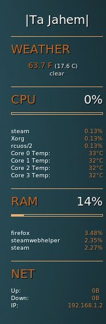

#tajahem_sidebar conky theme
---

A simple conky theme with custom scripts to parse and display weather data and cpu temperature. 

Requires:

* [conky](conky.sourceforge.net)
* [weather-util](fungi.yuggoth.org/weather/)
* lm-sensors - couldn't find a link, but check with your package manager

_Note: weather data is checked every 15 minutes by default._

##Installation

If you do not already have them you will need conky, weather-util, and lm-sensors. Links are above or if you are on Ubuntu:

`sudo apt-get install conky weather-util lm-sensors`

Next download the tajahem_sidebar files from the repository and unzip them into the conky directory (typically _"HOME/.conky"_). Unless you are using [Conky Theme Manager](teejeetech.in/p/conky-manager.html); the hidden file **.conkyrc** and the **scripts** folder should be in the root of the .conky directory (you may have to overwrite the default .conkyrc file). 

##Customization

The weather script takes everything it needs as an argument so all of the relevant changes should only have to be made to the .conkyrc file. The easiest method for most changes is to use a find and replace utility such as sed.
_Note: the example commands assume your current working directory is the directory containing tajahem_sidebar's .conkyrc file._

**Weather -**
check with [the weather FAQ](http://fungi.yuggoth.org/weather/doc/faq.rst) or `man weather` for information on finding your weather station. Once you've got it replace **KOGA** in .conkyrc with your station id (US zipcodes work sometimes)

example: `sed -i "s/KOGA/69138/g" .conkyrc`

**Name -**
replace **|Ta Jahem|** with your desired static header information

example: `sed -i "s/|Ta Jahem|/Bob the Terrible/g" .conkyrc`

**Fonts -** 
replace **DejaVu Sans** with your prefered font. 

example: `sed -i "s/DejaVu Sans/Ubuntu Mono/g" .conkyrc`

**Colors -** are listed in the **#colors section**. Default colors can be replaced with either a hexidecimal color code or any [color name recognized by x11](wikipedia.org/wiki/X11_color_names#Color_name_chart).